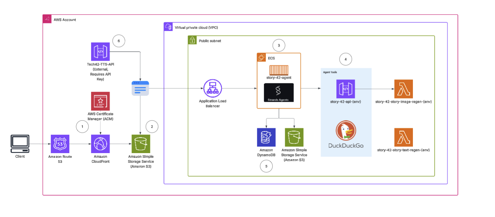

# Story-42 AI Agent - AWS Infrastructure

Complete guide for deploying and managing the Story-42 AI Agent infrastructure on AWS.

## 📋 Table of Contents

- [Architecture](#architecture)
- [Prerequisites](#prerequisites)
- [Quick Start](#quick-start)
- [Deployment Workflow](#deployment-workflow)
- [Docker Build & Deployment](#docker-build--deployment)
- [Lambda Updates](#lambda-updates)
- [Infrastructure Management](#infrastructure-management)
- [API Documentation](#api-documentation)
- [Troubleshooting](#troubleshooting)

---

### Architecture



1. Amazon Route 53 → CloudFront → AWS Certificate Manager (ACM)

   - The client’s requests are routed through Amazon Route 53 (DNS and traffic management) to CloudFront (content delivery/distribution). SSL certificates provided by AWS Certificate Manager (ACM) secure communication between services.

1. Amazon S3 (Static Asset Storage)

    - After passing through CloudFront, static assets such as images, CSS files, and frontend resources are retrieved from Amazon S3, which serves as the core storage for web content.

1.  ECS (Backend Compute: story-42-agent)

    - The Application Load Balancer forwards dynamic/backend requests into a scalable ECS cluster running the story-42-agent, which contains the primary microservices or containers for executing agent logic using Strand framework.

1. Agent Tools (API and Lambda Integrations)

    - story-42-api-{env} exposes logical endpoints consumed by the agent.

    - DuckDuckGo integration enables search capabilities.

    - Lambda functions (story-42-story-image-regen-{env} and story-42-story-text-regen-{env}) are invoked to perform auxiliary tasks like media regeneration and text processing.

1. Databases and Storage (Amazon DynamoDB & S3)

    - The ECS agents interact with Amazon DynamoDB for NoSQL, low-latency structured data storage and use Amazon S3 for persistent large-object storage (such as generated stories, images, or logs).

1. Tech42-TTS-API (External Text-to-Speech Integration)

    - An external Text-to-Speech API service that converts textual content to voice responses. It requires API keys for secure access. Connects through the load balancer to the architecture.

---

## Prerequisites

### Required Tools

- **AWS CLI** v2.0+
- **Terraform** v1.0+
- **Docker** v20.0+ with buildx support
- **Python** 3.12 (for local development)

### AWS Setup

```bash
# Configure AWS credentials
aws configure

# Or use environment variables
export AWS_ACCESS_KEY_ID="your-access-key"
export AWS_SECRET_ACCESS_KEY="your-secret-key"
export AWS_DEFAULT_REGION="us-west-2"
```

### Required AWS Permissions

Your AWS credentials need access to:
- ECR, Lambda, API Gateway, ECS
- VPC, EC2, ELB
- S3, DynamoDB, Cognito
- CloudFront, Secrets Manager, IAM

---

## Quick Start

### 1. Clone and Navigate

```bash
cd terraform/environments/dev/us-west-2
```

### 2. Create Configuration

```bash
cp terraform.tfvars.example terraform.tfvars
```

Edit `terraform.tfvars`:
```hcl
project_name        = "story-42-west"
environment         = "dev"
region              = "us-west-2"
admin_email         = "admin@example.com"
admin_temp_password = "TempPassword123!"
google_api_key      = "your-google-api-key"

# Phase 1: Infrastructure only
images_ready = false
```

### 3. Deploy Phase 1 (Infrastructure)

```bash
terraform init
terraform plan
terraform apply
```

**Phase 1 Creates:**
- ✅ ECR repositories (empty, ready for images)
- ✅ VPC with public subnets
- ✅ S3, DynamoDB, Cognito, Secrets Manager
- ❌ Lambda, API Gateway, ECS (waiting for Docker images)

### 4. Build and Push Docker Images to ECR

Before deploying compute services, you need to push Docker images to ECR repositories.

#### ECR Login

```bash
export AWS_REGION=us-west-2
ACCOUNT_ID=$(aws sts get-caller-identity --query Account --output text)

aws ecr get-login-password --region us-west-2 | \
  docker login --username AWS --password-stdin $ACCOUNT_ID.dkr.ecr.us-west-2.amazonaws.com
```

#### Build and Push Text Generation Lambda

```bash
cd docker/story-text-regen

docker buildx build --platform linux/amd64 -t story-text-regen:latest .
docker tag story-text-regen:latest $ACCOUNT_ID.dkr.ecr.us-west-2.amazonaws.com/story-42-west-lambda-dev:latest
docker push $ACCOUNT_ID.dkr.ecr.us-west-2.amazonaws.com/story-42-west-lambda-dev:latest
```

#### Build and Push Image Generation Lambda

```bash
cd ../story-image-regen

docker buildx build --platform linux/amd64 -t story-image-regen:latest .
docker tag story-image-regen:latest $ACCOUNT_ID.dkr.ecr.us-west-2.amazonaws.com/story-42-west-story-image-lambda-dev:latest
docker push $ACCOUNT_ID.dkr.ecr.us-west-2.amazonaws.com/story-42-west-story-image-lambda-dev:latest
```

#### Verify Images in ECR

```bash
aws ecr describe-images --repository-name story-42-west-lambda-dev --region us-west-2
aws ecr describe-images --repository-name story-42-west-story-image-lambda-dev --region us-west-2
```

### 5. Deploy Phase 2 (Compute Services)

Edit `terraform.tfvars`:
```hcl
images_ready = true  # ← Change to true
```

```bash
cd ../terraform/environments/dev/us-west-2
terraform apply
```

**Phase 2 Creates:**
- ✅ Lambda functions (text & image generation)
- ✅ API Gateway with Cognito authorizer
- ✅ ECS Fargate cluster and service
- ✅ Application Load Balancer

### 6. Get API Endpoints

```bash
terraform output
```

---

## Deployment Workflow

### 2-Phase Deployment Strategy

The deployment uses a `images_ready` variable to control infrastructure creation:

#### Phase 1: `images_ready = false`
Creates ECR repositories and base infrastructure, but NOT compute services (Lambda/ECS).

#### Phase 2: `images_ready = true`
Creates compute services that depend on Docker images.

### Why 2 Phases?

Lambda and ECS require Docker images to exist in ECR before they can be created. The 2-phase approach prevents circular dependencies.

---

---

## Lambda Updates

> ⚠️ **Important**: This section is for updating Lambda functions **AFTER the first deployment is complete**. If you haven't deployed yet, follow the [Quick Start](#quick-start) guide first.

### Update All Lambda Functions (Automated)

Use the automated deployment script to update all Lambda functions at once:

```bash
# From repository root
./scripts/rebuild_and_deploy.sh
```

This script:
1. Builds all three Docker images with `linux/amd64` platform
2. Pushes images to their respective ECR repositories
3. Updates Lambda function code to use new images

### Update Individual Lambda Functions

#### 1. Story Text Generation Lambda

```bash
export AWS_PROFILE=sandbox
export AWS_REGION=us-west-2

cd docker/story-text-regen

# Build image
docker buildx build --platform linux/amd64 -t story-text-regen:latest .

# Login to ECR
aws ecr get-login-password --region us-west-2 | \
  docker login --username AWS --password-stdin <account-id>.dkr.ecr.us-west-2.amazonaws.com

# Tag and push
docker tag story-text-regen:latest \
  <account-id>.dkr.ecr.us-west-2.amazonaws.com/story-42-west-lambda-dev:latest
docker push <account-id>.dkr.ecr.us-west-2.amazonaws.com/story-42-west-lambda-dev:latest

# Update Lambda
aws lambda update-function-code \
  --function-name story-42-west-story-text-regen-dev \
  --image-uri <account-id>.dkr.ecr.us-west-2.amazonaws.com/story-42-west-lambda-dev:latest \
  --region us-west-2
```

#### 2. Story Image Generation Lambda

```bash
cd docker/story-image-regen

# Build image
docker buildx build --platform linux/amd64 -t story-image-regen:latest .

# Login to ECR (if not already logged in)
aws ecr get-login-password --region us-west-2 | \
  docker login --username AWS --password-stdin <account-id>.dkr.ecr.us-west-2.amazonaws.com

# Tag and push
docker tag story-image-regen:latest \
  <account-id>.dkr.ecr.us-west-2.amazonaws.com/story-42-west-story-image-lambda-dev:latest
docker push <account-id>.dkr.ecr.us-west-2.amazonaws.com/story-42-west-story-image-lambda-dev:latest

# Update Lambda
aws lambda update-function-code \
  --function-name story-42-west-story-image-regen-dev \
  --image-uri <account-id>.dkr.ecr.us-west-2.amazonaws.com/story-42-west-story-image-lambda-dev:latest \
  --region us-west-2
```

#### 3. Data Operations Lambda

```bash
cd docker/data-ops

# Build and push using the build script
./build.sh

# Or manually:
docker buildx build --platform linux/amd64 -t data-ops:latest .

aws ecr get-login-password --region us-west-2 | \
  docker login --username AWS --password-stdin <account-id>.dkr.ecr.us-west-2.amazonaws.com

docker tag data-ops:latest \
  <account-id>.dkr.ecr.us-west-2.amazonaws.com/story-42-west-data-ops-lambda-dev:latest
docker push <account-id>.dkr.ecr.us-west-2.amazonaws.com/story-42-west-data-ops-lambda-dev:latest

aws lambda update-function-code \
  --function-name story-42-west-data-ops-dev \
  --image-uri <account-id>.dkr.ecr.us-west-2.amazonaws.com/story-42-west-data-ops-lambda-dev:latest \
  --region us-west-2
```

### Verify Lambda Updates

Check that Lambda is using the new image:

```bash
aws lambda get-function --function-name story-42-west-story-text-regen-dev \
  --region us-west-2 \
  --query 'Configuration.CodeSha256'
```

### Troubleshooting Docker Builds

If Docker build fails with cache issues:
```bash
docker builder prune -f  # Clear build cache
```

If platform mismatch errors occur, ensure you use `--platform linux/amd64`:
```bash
docker buildx build --platform linux/amd64 -t image-name:latest .
```

---

## Infrastructure Management

### View Deployed Resources

```bash
cd terraform/environments/dev/us-west-2

# View all outputs
terraform output

# View specific output
terraform output api_endpoint
terraform output ecs_service_endpoint
```

### Common Outputs

| Output | Description |
|--------|-------------|
| `api_endpoint` | API Gateway base URL |
| `cognito_user_pool_id` | Cognito User Pool ID |
| `ecs_service_endpoint` | ECS service ALB endpoint |
| `lambda_ecr_repository_url` | ECR URL for Lambda images |
| `s3_bucket_name` | S3 bucket for images |

### Update Infrastructure

```bash
# Review changes
terraform plan

# Apply changes
terraform apply
```

### Destroy Infrastructure

⚠️ **Warning**: This will delete all data!

```bash
cd terraform/environments/dev/us-west-2

# Review what will be destroyed
terraform plan -destroy

# Destroy all resources
terraform destroy
```

**Manual Cleanup** (if needed):

```bash
# Empty S3 bucket first
aws s3 rm s3://story-42-west-story-images-dev --recursive --region us-west-2

# Delete ECR images
aws ecr batch-delete-image \
  --repository-name story-42-west-lambda-dev \
  --image-ids imageTag=latest \
  --region us-west-2

# Delete CloudWatch logs
aws logs delete-log-group \
  --log-group-name /aws/lambda/story-42-west-story-text-regen-dev \
  --region us-west-2
```

---

## API Documentation

### Authentication

All API endpoints require Cognito authentication:

```bash
# Get Cognito token
aws cognito-idp admin-initiate-auth \
  --user-pool-id <pool-id> \
  --client-id <client-id> \
  --auth-flow ADMIN_NO_SRP_AUTH \
  --auth-parameters USERNAME=admin@example.com,PASSWORD=<password> \
  --region us-west-2
```

### Main Endpoints

| Endpoint | Method | Description |
|----------|--------|-------------|
| `/generate-story` | POST | Generate complete story |
| `/generate-story-outline` | POST | Generate story outline |
| `/generate-topics-ideas` | POST | Generate topic ideas |
| `/generate-story-image` | POST | Generate images for story |
| `/regenerate-segment` | POST | Regenerate text segment |
| `/regenerate-segment-image` | POST | Regenerate image |

**Full API Documentation**: See [API_DOCUMENTATION.md](./API_DOCUMENTATION.md)

---

## Troubleshooting

### ECR: Image Not Found

**Problem**: Lambda/ECS fails with "image not found"

**Solution**:
```bash
# Verify image exists in ECR
aws ecr describe-images \
  --repository-name story-42-west-lambda-dev \
  --region us-west-2

# If missing, rebuild and push
cd docker/lambda
./build.sh
```

### Lambda: Timeout Errors

**Problem**: Lambda function timing out (15 min limit)

**Check logs**:
```bash
aws logs tail /aws/lambda/story-42-west-story-text-regen-dev --follow --region us-west-2
```

**Common causes**:
- Bedrock API slow response
- Large image generation
- DynamoDB throttling

### ECS: Tasks Not Starting

**Problem**: ECS service shows 0 running tasks

**Check status**:
```bash
aws ecs describe-services \
  --cluster story-42-west-ecs-cluster-dev \
  --services story-generator \
  --region us-west-2
```

**Common causes**:
- Docker image not in ECR
- Task definition errors
- Insufficient CPU/memory

**View logs**:
```bash
aws logs tail /ecs/story-42-west-dev --follow --region us-west-2
```

### API Gateway: 403 Forbidden

**Problem**: API returns 403 on authenticated endpoints

**Solution**:
1. Verify Cognito token is valid
2. Check user is in correct group
3. Verify API Gateway authorizer configuration

```bash
# Test authentication
aws apigateway test-invoke-authorizer \
  --rest-api-id <api-id> \
  --authorizer-id <authorizer-id> \
  --headers Authorization=<token> \
  --region us-west-2
```

### Terraform: State Issues

**Problem**: "Resource already exists" or state conflicts

**Solution**:
```bash
# Refresh state
terraform refresh

# Import existing resource
terraform import aws_lambda_function.main story-42-west-story-text-regen-dev

# Or force unlock if locked
terraform force-unlock <lock-id>
```

---

## Cost Optimization

### Estimated Monthly Costs (us-west-2)

| Service | Usage | Cost |
|---------|-------|------|
| Lambda | 1M requests, 2GB | ~$20 |
| ECS Fargate | 1 task, 0.5 vCPU | ~$15 |
| API Gateway | 1M requests | ~$3.50 |
| Bedrock | 1M tokens | ~$10 |
| S3 + DynamoDB | Low usage | ~$5 |
| **Total** | | **~$53.50/mo** |

### Cost Reduction Tips

1. **Stop ECS when not in use**:
   ```bash
   aws ecs update-service \
     --cluster story-42-west-ecs-cluster-dev \
     --service story-generator \
     --desired-count 0 \
     --region us-west-2
   ```

2. **Use Lambda only** (disable ECS):
   ```hcl
   # terraform.tfvars
   images_ready = false  # Don't create ECS
   ```

3. **S3 lifecycle policies**: Automatically delete old images after 30 days

---

## Quick Reference

### Common Commands

```bash
# Set AWS environment (always run first)
export AWS_PROFILE=sandbox
export AWS_REGION=us-west-2

# Terraform operations
cd terraform/environments/dev/us-west-2
terraform init                    # Initialize
terraform plan                    # Preview changes
terraform apply -auto-approve     # Deploy
terraform destroy -auto-approve   # Destroy
terraform output                  # View outputs

# Lambda updates
./scripts/rebuild_and_deploy.sh   # Update all Lambdas

# Docker cleanup
docker builder prune -f           # Clear build cache
docker system prune -a            # Full cleanup (use carefully)
```

### Resource Names Reference

| Resource Type | Name/ID |
|--------------|---------|
| **Lambda Functions** ||
| Text Generation | `story-42-west-story-text-regen-dev` |
| Image Generation | `story-42-west-story-image-regen-dev` |
| Data Operations | `story-42-west-data-ops-dev` |
| **ECR Repositories** ||
| Text Generation | `story-42-west-lambda-dev` |
| Image Generation | `story-42-west-story-image-lambda-dev` |
| Data Operations | `story-42-west-data-ops-lambda-dev` |
| ECS Service | `story-42-west-story-generator-dev` |
| **DynamoDB** ||
| Sessions Table | `story-42-west-story-sessions-dev` |
| **S3** ||
| Images Bucket | `story-42-west-story-images-dev` |
| **API Gateway** ||
| Stage | `dev` |
| **Cognito** ||
| User Pool Domain | `story-42-west-user-pool-dev` |
| **ECS** ||
| Cluster | `story-42-west-ecs-cluster-dev` |
| Service | `story-generator` |
| ALB | `story-42-west-alb-dev` |

---

## Support

### Getting Help

1. Check [API_DOCUMENTATION.md](./API_DOCUMENTATION.md) for endpoint details
2. Review CloudWatch logs for error messages
3. Verify AWS service quotas and limits

### Useful AWS CLI Commands

```bash
# List all Lambda functions
aws lambda list-functions --region us-west-2

# List ECS services
aws ecs list-services --cluster story-42-west-ecs-cluster-dev --region us-west-2

# Check S3 bucket size
aws s3 ls s3://story-42-west-story-images-dev --recursive --summarize --region us-west-2

# Monitor API Gateway
aws apigateway get-rest-apis --region us-west-2
```

---

## License

© 2025 Tech42 Consulting. All rights reserved.

